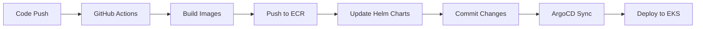

# ResQConnect Transformation Plan

## Overview
Transform the retail store microservices architecture into ResQConnect (Community Calamity Response Network) while maintaining the exact same CI/CD and deployment strategy.

## Service Transformation Mapping

### Phase 1: Core Service Transformation (Existing Services)

| Current Service | ResQConnect Service | Language | Port | Purpose |
|----------------|-------------------|----------|------|---------|
| **UI** → **Coordinator UI** | Java (Spring Boot) | 8080 | Web interface for coordinators |
| **Catalog** → **Request Service** | Go | 8081 | CRUD for disaster requests |
| **Cart** → **Volunteer Service** | Java (Spring Boot) | 8082 | Volunteer profiles & availability |
| **Orders** → **Matching Service** | Java (Spring Boot) | 8083 | Match requests to volunteers |
| **Checkout** → **Notification Service** | Node.js (NestJS) | 8084 | Push/SMS notifications |

### Phase 2: New Services (Additional)

| Service | Language | Port | Purpose |
|---------|----------|------|---------|
| **Ingest Service** | Python (FastAPI) | 8085 | SMS/WhatsApp/Forms ingestion |
| **NLP Service** | Python (FastAPI) | 8086 | Intent extraction & geocoding |
| **Graph Service** | Java (Spring Boot) | 8087 | Neo4j access layer |
| **Realtime Service** | Node.js (Socket.IO) | 8088 | WebSocket updates |
| **Analytics Service** | Python (FastAPI) | 8089 | Data pipeline & reporting |

## Infrastructure Preservation

### Unchanged Components
- ✅ **Terraform configuration** (main.tf, variables.tf, outputs.tf)
- ✅ **EKS cluster setup** with Auto Mode
- ✅ **ArgoCD installation** and configuration
- ✅ **GitHub Actions workflow** (deploy.yml)
- ✅ **Helm chart structure** and patterns
- ✅ **ECR repositories** and image management
- ✅ **Ingress and networking** setup

### Minimal Changes Required
- 🔄 **Service names** in ArgoCD applications
- 🔄 **Helm chart values** for new service endpoints
- 🔄 **GitHub Actions matrix** to include new services
- 🔄 **README documentation** updates

## Implementation Strategy

### Step 1: Rename Existing Services
1. Update ArgoCD application names
2. Update Helm chart names and values
3. Update service discovery endpoints
4. Update GitHub Actions service matrix

### Step 2: Add New Services
1. Create new service directories following existing pattern
2. Add Dockerfiles and source code
3. Create Helm charts using existing templates
4. Add ArgoCD applications
5. Update GitHub Actions to include new services

### Step 3: Update Configuration
1. Update service-to-service communication endpoints
2. Configure event bus (Kafka) integration
3. Add database configurations (Postgres, Neo4j, Redis)
4. Update ingress routing

## Event-Driven Architecture

### Event Bus Integration
- **Kafka** for async communication
- **Event topics**: request.created, request.enriched, match.proposed, etc.
- **Service communication**: HTTP for sync, Kafka for async

### Data Stores
- **Request Service**: PostgreSQL
- **Volunteer Service**: PostgreSQL + Redis
- **Graph Service**: Neo4j
- **Matching Service**: Redis cache
- **NLP Service**: Model artifacts in S3
- **Analytics Service**: Data lake (S3) + ClickHouse

## Deployment Flow (Unchanged)

## Benefits of This Approach

1. **Zero Infrastructure Changes**: Same Terraform, EKS, ArgoCD setup
2. **Proven CI/CD Pipeline**: Existing GitHub Actions workflow works unchanged
3. **Familiar Patterns**: Same Helm chart structure and deployment patterns
4. **Gradual Migration**: Can transform services one by one
5. **Operational Continuity**: Same monitoring, logging, and troubleshooting procedures

## Next Steps

1. Execute service renaming and transformation
2. Implement new services following existing patterns
3. Update documentation and configuration
4. Test end-to-end deployment pipeline
5. Validate ResQConnect functionality

This approach ensures minimal risk while leveraging the robust, production-ready infrastructure already in place.
 
---

## Detailed Microservices Blueprint (ResQConnect)

### Rationale
- Decoupled services allow independent scaling and deployment.
- Different components have varying latency, compute, and data requirements.
- Enables polyglot programming (Python for NLP/ingest/analytics, Go for request, Java for matching/volunteer/graph-proxy, Node.js for realtime/notifications).

### Service Boundary Map
Ingress → API Gateway → {Ingest, Auth, Volunteer, Request, Matching, NLP, Notification, Graph, Analytics} → Realtime → Frontends

### Core Services (One-liners)
- API Gateway: routing, auth, rate-limiting, request validation.
- Auth Service: Firebase/Auth connector, RBAC, token issuance.
- Ingest Service: SMS/WhatsApp/IVR/social adapters, dedupe, enqueue.
- NLP Service: intent/entity extraction, geocoding, urgency scoring; returns structured payloads.
- Request Service: CRUD for Requests; source of truth; emits events and writes to Graph.
- Volunteer Service: profiles, skills, availability; source of truth for volunteer data.
- Matching Service: subscribes to request events, computes matches using Graph + caches; emits proposals.
- Graph Service: Neo4j access layer; sole writer for graph nodes/edges.
- Notification Service: push/SMS/email; retries and delivery status.
- Realtime Service: websocket/push fanout of events to clients.
- Analytics Service: OLAP exports, dashboards, historical training data pipeline.

### Data Ownership & Per-Service Stores
- Auth: Firebase/Cognito (managed identity; no self-hosted DB).
- Ingest: Redis (dedupe), S3 for raw payloads, Kafka/RabbitMQ topics.
- NLP: S3/model registry for artifacts, Redis cache, Postgres for labeled examples/metadata.
- Request: Postgres (request metadata/source of truth).
- Volunteer: Postgres (profiles), Redis (presence/availability cache).
- Graph: Neo4j (relationships; sole writer).
- Matching: Redis (candidate caches/scores), optional Postgres/Neo4j for audits.
- Notification: Postgres (delivery logs), Twilio/FCM integrations.
- Realtime: Redis (session store) or Firestore when using Firebase.
- Analytics: S3 data lake; ClickHouse/BigQuery for OLAP.

### Communication Patterns
- Synchronous: Frontend → API Gateway → Request/Volunteer/etc. for CRUD; low-latency reads use caches.
- Asynchronous: Event bus (Kafka/RabbitMQ) for lifecycle events and workflows.
- Graph: Matching → Graph via HTTP/gRPC for traversals; use cached snapshots for heavy loads.
- Realtime: Realtime subscribes to events and relays via WebSocket/FCM.

### Event Bus Topics (Examples)
- ingest.raw
- request.created
- request.enriched
- match.proposed
- match.accepted
- assignment.confirmed
- volunteer.status_changed

### End-to-end Flow (Sample)
1) Victim sends SMS → Ingest receives, stores raw, emits `ingest.raw`.
2) NLP consumes `ingest.raw`, extracts intent/location/urgency, emits `request.enriched`.
3) Request consumes `request.enriched`, creates record, calls Graph to upsert nodes/edges, emits `request.created`.
4) Matching consumes `request.created`, queries Graph, computes scores, caches top-K, emits `match.proposed`.
5) Notification listens to `match.proposed` and notifies volunteers.
6) Volunteer accepts → Volunteer Service records and emits `match.accepted`.
7) Request/Matching finalize assignment; Graph updated with `ASSIGNED_TO` edge; Notification confirms to victim/coordinator.
8) Analytics snapshots events for training/insights.

### Service Contracts & API Sketches
- Request Service (REST)
  - POST /requests — create from enriched payload
  - GET /requests/{id}
  - GET /requests?status=open&bbox=…
- Matching Service (gRPC)
  - rpc GetCandidates(RequestLocation) returns (Candidates)
- Graph Service (HTTP/gRPC)
  - POST /graph/nodes
  - POST /graph/edges
  - POST /graph/query (read-only, parameterized)

All responses include a `trace_id` header for observability.

### Scaling & Resilience
- Autoscaling: HPA for NLP and Matching based on CPU/memory and custom metrics (queue lag, latency).
- Backpressure: Kafka retention; workers scale to drain backlog; API Gateway rate-limits.
- Circuit breakers & retries: resilience4j/Retriable clients with exponential backoff.
- Caching: Redis geohash buckets to offload Neo4j hotspots.
- Graceful degradation: fallback rule-based NLP when models fail; mark for human review.

### Security & Data Privacy
- Zero-trust: mTLS between services; k8s NetworkPolicies.
- Auth: JWT from Auth Service; scopes define actions; short-lived tokens for sensitive ops.
- PII: Hash phone numbers at Ingest; encryption at rest; Graph exposes pseudonymized IDs.
- Audit: Centralized immutable logs (ELK/OpenSearch) with retention.

### Observability & SLOs
- Tracing: OpenTelemetry end-to-end; propagate `trace_id`.
- Metrics: Prometheus per service (latency, throughput, queue lag, NLP confidence).
- SLOs: e.g., P95 time-to-match for high priority < 300s; NLP confidence > 0.7 for 80%.
- Dashboards/Alerts: Grafana dashboards; alerts for backlog growth, match failures, FP spikes.

### CI/CD & Release Strategy (Minimal-Change Alignment)
- Repo layout: Keep existing monorepo structure under `src/*`; if polyrepo is later desired, mirror the current patterns per service.
- Pipeline steps (unchanged): PR → unit/lint → container build → integration tests (test env with mocks) → canary to staging → smoke tests → manual promote to prod.
- DB migrations: Continue with per-service tools (Flyway for Java, Alembic for Python, Go migrations) as `initContainers`/`postStart` hooks or separate jobs.
- Image registry: ECR unchanged.
- GitOps: ArgoCD watches Helm charts; values updates drive rollouts. Keep the same ArgoCD Applications.

Minimal changes to apply:
- Update ArgoCD app names/paths for any newly added services to match `src/*/chart`.
- Extend Helm values for env vars: Kafka brokers, Redis/Neo4j/Postgres endpoints, topic names.
- Add services to CI matrix/build steps while reusing the existing workflow.

### Kubernetes Topology (drm-prod)
- Deployments: ingest, nlp, request, volunteer, matching, graph-proxy, notification, realtime, analytics.
- Shared infra: kafka, redis, neo4j (or managed), s3, prometheus, elastic.
- Add `HorizontalPodAutoscaler` and `PodDisruptionBudget` for critical services.

### Operational Playbooks
- NLP lag: check Kafka consumer lag → scale workers → rollback model if failing → open incident.
- Graph hotspot: monitor slow Cypher → add read-replica or cache layer → throttle complex queries.
- Notification failure: inspect logs → push to retry queue → escalate via SMS credits.

### Migration & Evolution Plan
- Start with minimal split: Ingest, NLP (sync OK initially), Request, Matching (distance baseline), Notification. Keep Graph as managed.
- Split Volunteer, Realtime, Analytics as traffic grows.
- Introduce gRPC for high-throughput reads (matching → graph) as needed.

### Example Event Schemas
`request.enriched`
{
  "request_id": "req-501",
  "timestamp": "2025-09-25T06:12:45Z",
  "source": "sms",
  "text": "Trapped on 5th floor, need water and medical help",
  "lang": "en",
  "intent": "request_supply",
  "entities": [{"label":"item","text":"water"},{"label":"need","text":"medical"}],
  "location": {"lat": 18.5204, "lon": 73.8567, "confidence": 0.82},
  "urgency": 9,
  "confidence": 0.78,
  "trace_id": "trace-abc-123"
}

`match.proposed`
{
  "request_id": "req-501",
  "proposals": [
    {"volunteer_id": "vol-0001", "score": 0.86, "eta_mins": 12},
    {"volunteer_id": "vol-0007", "score": 0.72, "eta_mins": 19}
  ],
  "created_at": "2025-09-25T06:12:57Z",
  "trace_id": "trace-abc-123"
}

---

## Codebase Mapping to Services & Artifacts

This repository already contains most services and their Helm charts aligned with the target architecture. We retain the exact deployment/CI patterns and only adjust names and values where needed.

- Coordinator UI → `src/coordinator-ui/` (Java + Helm chart under `chart/`)
- Request Service → `src/request-service/` (Go + Helm chart under `chart/`)
- Volunteer Service → `src/volunteer-service/` (Java + Helm chart under `chart/`)
- Matching Service → `src/matching-service/` (Java + Helm chart under `chart/`)
- Notification Service → `src/notification-service/` (NestJS + Helm chart under `chart/`)
- Realtime Service → `src/realtime-service/` (Node.js + Helm chart under `chart/`)
- Graph Service → `src/graph-service/` (Java + Helm chart under `chart/`)
- Ingest Service → `src/ingest-service/` (Python + Helm chart under `chart/`)
- NLP Service → `src/nlp-service/` (Python + Helm chart under `chart/`)
- Analytics Service → `src/analytics-service/` (Python + Helm chart under `chart/`)

ArgoCD Applications (unchanged pattern): `argocd/applications/*.yaml`

Terraform/EKS (unchanged): `terraform/*.tf`

Helm Values to extend minimally per service:
- Kafka: `KAFKA_BROKERS`, topic names (e.g., `REQUEST_CREATED_TOPIC`)
- Datastores: `POSTGRES_URL`, `NEO4J_URI`, `REDIS_URL`, S3 buckets
- Observability: OTEL exporter endpoint, Prometheus scraping annotations
- Security: mTLS secrets, JWT issuer/audience

---

## CI/CD Alignment (Reuse Current Setup)

We keep the existing GitHub Actions workflow and ArgoCD-driven deployments. Minimal updates:

1. Extend build matrix to include any newly added services (keep existing naming convention per `src/*`).
2. Ensure each service Dockerfile builds locally and in CI (already present for all current services).
3. Helm charts: reuse `src/*/chart` templates; only adjust `values.yaml` for service-specific env/config.
4. ArgoCD: add/update Application manifests pointing at each service chart directory; keep same sync policies.
5. Migrations: wire per-service migration jobs as part of chart templates if needed.

No changes needed to Terraform, cluster bootstrap, ArgoCD installation, or ECR provisioning.

---

## Testing & Local Development

- Integration tests with Testcontainers (Postgres/Neo4j/Redis/Kafka) per service.
- Contract testing via Pact between Request/Volunteer/Matching/Graph/Notification.
- Chaos experiments targeting NLP/Graph to validate degradation paths.
- Simulation harness to replay `ingest.raw` for drills and SLO validation.

---

## Next Actions Checklist (Minimal diffs)
1) Add Kafka/Redis/Neo4j/Postgres env values into each service `values.yaml`.
2) Add/confirm ArgoCD Applications for all services under `argocd/applications/`.
3) Extend CI build matrix to include any new or renamed services.
4) Roll out to staging via ArgoCD; run smoke and contract tests; promote with approval.

---

## Current vs Required: Gap Analysis and Closure

### Service Presence (repo → required)
| Service | Repo Path | Chart Present | ArgoCD App | Status |
|--------|-----------|---------------|------------|--------|
| Coordinator UI | `src/coordinator-ui/` | Yes | `argocd/applications/resqconnect-coordinator-ui.yaml` | OK |
| Request Service | `src/request-service/` | Yes | `argocd/applications/resqconnect-request-service.yaml` | OK |
| Volunteer Service | `src/volunteer-service/` | Yes | `argocd/applications/resqconnect-volunteer-service.yaml` | OK |
| Matching Service | `src/matching-service/` | Yes | `argocd/applications/resqconnect-matching-service.yaml` | OK |
| Notification Service | `src/notification-service/` | Yes | `argocd/applications/resqconnect-notification-service.yaml` | OK |
| Realtime Service | `src/realtime-service/` | Yes | `argocd/applications/resqconnect-realtime-service.yaml` | OK |
| Graph Service | `src/graph-service/` | Yes | `argocd/applications/resqconnect-graph-service.yaml` | OK |
| Ingest Service | `src/ingest-service/` | Yes | `argocd/applications/resqconnect-ingest-service.yaml` | OK |
| NLP Service | `src/nlp-service/` | Yes | `argocd/applications/resqconnect-nlp-service.yaml` | OK |
| Analytics Service | `src/analytics-service/` | Yes | `argocd/applications/resqconnect-analytics-service.yaml` | OK |

### Infrastructure & CI/CD (minimal-change principle)
- Terraform EKS/ArgoCD/ECR: Present under `terraform/` → OK
- Helm per service: Present under `src/*/chart` → OK
- ArgoCD Applications: Present under `argocd/applications/` → OK
- GitOps flow (charts → ArgoCD sync): Documented and unchanged → OK

### Pending Transformations to Fully Match Required Architecture
These are configuration-only and preserve the existing CI/CD/deployment patterns:

1) Event Bus wiring (Kafka/RabbitMQ)
   - Add env values in each service chart `values.yaml` for brokers and topics:
     - `KAFKA_BROKERS`, `KAFKA_SASL_*` (if applicable)
     - Topic names: `ingest.raw`, `request.created`, `request.enriched`, `match.proposed`, `match.accepted`, `assignment.confirmed`, `volunteer.status_changed`
   - Reference points: `src/*/chart/values.yaml`

2) Datastore connection configuration
   - Request/Volunteer: `POSTGRES_URL` (and secrets)
   - Graph: `NEO4J_URI`, `NEO4J_USER`, `NEO4J_PASSWORD`
   - Matching/Volunteer/Realtime: `REDIS_URL`
   - NLP/Analytics/Ingest: `S3_BUCKET`, `S3_REGION`, credentials via secrets
   - Reference points: `src/*/chart/values.yaml`

3) Observability & tracing
   - Standardize OTEL envs across services: `OTEL_EXPORTER_OTLP_ENDPOINT`, `OTEL_RESOURCE_ATTRIBUTES` (service.name), sampling ratio
   - Enable Prometheus scrape annotations in service charts where missing

4) Security hardening (network & identity)
   - mTLS: ensure chart values reference secrets for client/server certs where required
   - JWT: set `JWT_ISSUER`, `JWT_AUDIENCE`, and API Gateway pass-through config

5) CI matrix completeness
   - Confirm CI builds all `src/*` services and pushes to ECR (extend matrix if any are missing)

### Closure Plan (no infra changes, config only)
- For each service under `src/*/chart/values.yaml`, add or confirm:
  - Event bus settings (brokers, topic names)
  - Datastore endpoints and credentials (as Kubernetes Secrets references)
  - OpenTelemetry exporter endpoint and labels
  - Security (JWT/mTLS) envs as needed
- No Terraform or ArgoCD structural edits required; only values updates and secret provisioning in the cluster.

Once values are updated and committed, ArgoCD will reconcile and roll out changes using the existing pipeline.
